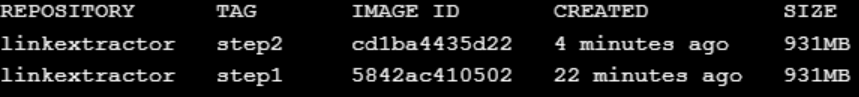
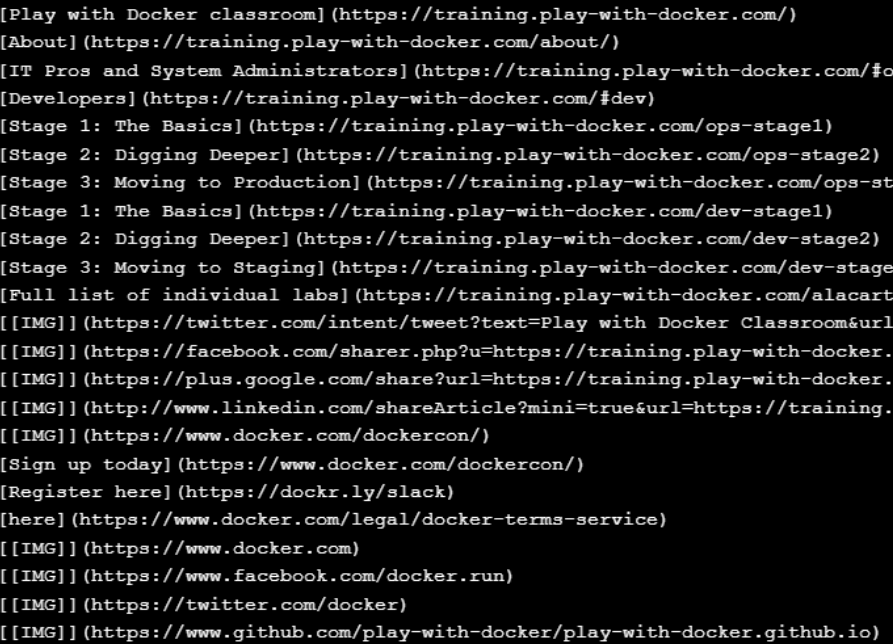
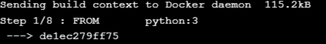
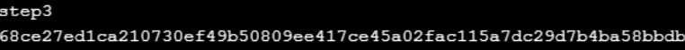
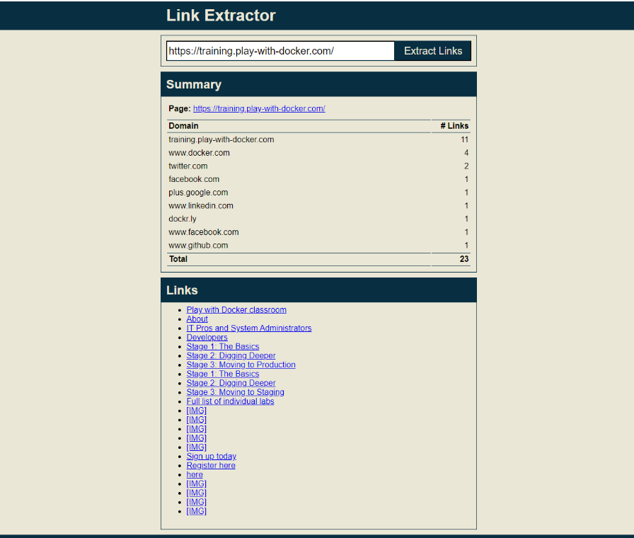

# Application Containerization and Microservice Orchestration

**nome**: Pedro Henrique Gomes \
**matricula**: 1820365-x


### Config Setup

* Clonando repositório
* Checkout na branch **demo**

```bash
git clone https://github.com/ibnesayeed/linkextractor.git
cd linkextractor
git checkout demo
```

### Step 0

* Checkout na branch **step0**
* Checamos com o tree os arquivos presentes nessa branch.

```bash
git checkout step0
tree
```

### Step 1

* Checkout na branch **step1**
* Checamos com o tree os arquivos presentes nessa branch.

```bash
git checkout step1
tree
```
* Utilizando o _cat_ podemos ver o conteúdo do **Dockerfile**

```bash
cat Dockerfile
```

```dockerfile
FROM       python:3
LABEL      maintainer="Pedro Gomes <@pehgomes>" #Coloquei meu nome como mantenedor dessa imagem

RUN        pip install beautifulsoup4
RUN        pip install requests

WORKDIR    /app
COPY       linkextractor.py /app/
RUN        chmod a+x linkextractor.py

ENTRYPOINT ["./linkextractor.py"]
```
* Após conferir, podemos "buildar" nossa imagem, com seu **nome_imagem**:**nome_tag**
```bash
docker build -t linkextractor:step1 .
```

* Com o comando abaixo, poderemos ver a lista de imagens criadas.
```bash
docker image ls
```


* Após a imagem estar criada, iremos inicializar nosso container com a mesma
```bash
docker container run -it --rm linkextractor:step1 https://training.play-with-docker.com/
```




### Step 2

* Checkout na branch **step2**
* Checamos com o cat o conteúdo do arquivo linkextractor.py

```bash
git checkout step2
cat linkextractor.py
```


* Agora com uma nova versão do código, iremos buildar uma nova imagem,
com o mesmo nome, contudo desta vez com a **tag** _step2_
* Em seguida listaremos as imagens criadas.

```bash
docker build -t linkextractor:step2 .
docker image ls
```


* Com o comando abaixo, inicializaremos nossa containerização para a segunda imagen.

```bash
docker container run -it --rm linkextractor:step2 https://training.play-with-docker.com/
```


* Também podemos fazer isso para a primeira imagem
```bash
docker container run -it --rm linkextractor:step1 https://training.play-with-docker.com/
```


### Step 3

* Checkout para a branch step3.

```bash
git checkout step3
tree
```

```bash
.
├── Dockerfile
├── README.md
├── linkextractor.py
├── main.py
└── requirements.txt

0 directories, 5 files
```

* Conteudo do Dockerfile.

```dockerfile
FROM       python:3
LABEL      maintainer="Sawood Alam <@ibnesayeed>"

WORKDIR    /app
COPY       requirements.txt /app/
RUN        pip install -r requirements.txt

COPY       *.py /app/
RUN        chmod a+x *.py

CMD        ["./main.py"]
```

* Conteúdo do main.py, novo arquivo vindo nessa branch.

```bash
cat main.py
```

```python
#!/usr/bin/env python

from flask import Flask
from flask import request
from flask import jsonify
from linkextractor import extract_links

app = Flask(__name__)

@app.route("/")
def index():
    return "Usage: http://<hostname>[:<prt>]/api/<url>"

@app.route("/api/<path:url>")
def api(url):
    qs = request.query_string.decode("utf-8")
    if qs != "":
        url += "?" + qs
    links = extract_links(url)
    return jsonify(links)

app.run(host="0.0.0.0")
```
* Em seguida, com o Dockerfile atualizado, faremos o build de uma nova imagem com o mesmo nome das anteriores, contudo mudando sua tag.

```bash
docker build -t linkextractor:step3 .
```

[imagem-docker-3]

* Após isso, rodar container para a imagem criada anteriormente, porém dessa vez mapeando a porta do container 5000 para a porta 5000 do host.

```bash
docker container run -d -p 5000:5000 --name=linkextractor linkextractor:step3
```

[imagem-docker-3.1]

* Com o comando abaixo faremos uma request para o container local

```bash
curl -i http://localhost:5000/api/http://example.com/
```

```bash
HTTP/1.0 200 OK
Content-Type: application/json
Content-Length: 78
Server: Werkzeug/0.14.1 Python/3.7.0
Date: Sun, 23 Sep 2018 20:52:56 GMT

[{"href":"http://www.iana.org/domains/example","text":"More information..."}]
```


* Com o comando abaixo é possível ver os logs dos containers
* após isso, iremos remover o container

```bash
docker container logs linkextractor
```
```bash
docker container rm -f linkextractor
```

### Step 4

* Repetiremos o procedimento de mudar de branch
* Veremos o que há de novo pelo _tree_ .

```bash
git checkout step4
tree

.
├── README.md
├── api
│   ├── Dockerfile
│   ├── linkextractor.py
│   ├── main.py
│   └── requirements.txt
├── docker-compose.yml
└── www
    └── index.php
```

* Podemos observar o arquivo *docker-compose.yml*

```dockerfile
version: '3'

services:
  api:
    image: linkextractor-api:step4-python
    build: ./api
    ports:
      - "5000:5000"
  web:
    image: php:7-apache
    ports:
      - "80:80"
    environment:
      - API_ENDPOINT=http://api:5000/api/
    volumes:
      - ./www:/var/www/html


```
* E o arquivo index.php

```php
$api_endpoint = $_ENV["API_ENDPOINT"] ?: "http://localhost:5000/api/";
$url = "";
if(isset($_GET["url"]) && $_GET["url"] != "") {
  $url = $_GET["url"];
  $json = @file_get_contents($api_endpoint . $url);
  if($json == false) {
    $err = "Something is wrong with the URL: " . $url;
  } else {
    $links = json_decode($json, true);
    $domains = [];
    foreach($links as $link) {
      array_push($domains, parse_url($link["href"], PHP_URL_HOST));
    }
    $domainct = @array_count_values($domains);
    arsort($domainct);
  }
}
```

* Rodando o comando abaixo, inicializaremos o compose, construindo toda nossa composição, definição de portas e ordem de inicialização de containers

```bash
docker-compose up -d --build
```
* Após a inicialização dos containers, podemos fazer uma request para a porta 5000

```bash
curl -i http://localhost:5000/api/http://example.com/
```
* também podemos observar agora que localmente temos um container rodando e disponibilizando de forma gráfica uma página web



* Podemos fazer uma pequena modificação no index.php usando
```bash
sed -i 's/Link Extractor/Super Link Extractor/g' www/index.php
```


* Fazendo o stop do container
* Para remover nossa alteração, podemos rodar um comando git, voltando a versão do código do projeto para a versão de origem, inicial.
```bash
docker-compose down
git reset -hard
```

### Step 5

* Checkout na branch step5

```bash
git checkout step5
tree
```

```bash
├── README.md
├── api
│   ├── Dockerfile
│   ├── linkextractor.py
│   ├── main.py
│   └── requirements.txt
├── docker-compose.yml
└── www
    ├── Dockerfile
    └── index.php

2 directories, 8 files
```

* Agora, veremos o que há dentro do arquivo Dockerfile em www

```bash
cat www/Dockerfile
```

```dockerfile
FROM       php:7-apache
LABEL      maintainer="Sawood Alam <@ibnesayeed>"

ENV        API_ENDPOINT="http://localhost:5000/api/"

COPY       . /var/www/html/
```
* veremos também o arquivo main.py

```bash
cat api/main.py
```
[imagem-5]

* e o arquivo _docker-compose.yml_
```bash
cat docker-compose.yml
```
[imagem-5]

* para buildar o docker-compose usaremos o comando abaixo
```bash
docker-compose up -d --build
```

* pra checar o redis
```bash
docker-compose exec redis redis-cli monitor
```

### Step 6

```bash
git checkout step6
tree
```

```bash
.
├── README.md
├── api
│   ├── Dockerfile
│   ├── Gemfile
│   └── linkextractor.rb
├── docker-compose.yml
├── logs
└── www
    ├── Dockerfile
    └── index.php

3 directories, 7 files
```

* Veremos que agora há um arquivo com a extensão .rb
* Para ver o conteúdo do arquivo

```bash
cat api/linkextractor.rb
```
```ruby
#!/usr/bin/env ruby
# encoding: utf-8

require "sinatra"
require "open-uri"
require "uri"
require "nokogiri"
require "json"
require "redis"

set :protection, :except=>:path_traversal

redis = Redis.new(url: ENV["REDIS_URL"] || "redis://localhost:6379")

Dir.mkdir("logs") unless Dir.exist?("logs")
cache_log = File.new("logs/extraction.log", "a")

get "/" do
  "Usage: http://<hostname>[:<prt>]/api/<url>"
end

get "/api/*" do
  url = [params['splat'].first, request.query_string].reject(&:empty?).join("?")
  cache_status = "HIT"
  jsonlinks = redis.get(url)
  if jsonlinks.nil?
    cache_status = "MISS"
    jsonlinks = JSON.pretty_generate(extract_links(url))
    redis.set(url, jsonlinks)
  end

  cache_log.puts "#{Time.now.to_i}\t#{cache_status}\t#{url}"

  status 200
  headers "content-type" => "application/json"
  body jsonlinks
end

def extract_links(url)
  links = []
  doc = Nokogiri::HTML(open(url))
  doc.css("a").each do |link|
    text = link.text.strip.split.join(" ")
    begin
      links.push({
        text: text.empty? ? "[IMG]" : text,
        href: URI.join(url, link["href"])
      })
    rescue
    end
  end
  links
end
```

* para criar nossa imagem para a nova api em ruby

```bash
docker-compose up -d --build
```

```bash
OUTPUT REDACTED

Successfully built b713eef49f55
Successfully tagged linkextractor-api:step6-ruby
Creating linkextractor_web_1   ... done
Creating linkextractor_api_1   ... done
Creating linkextractor_redis_1 ... done
```

* Agora para a porta 4567, faremos a request
```bash
curl -i http://localhost:4567/api/http://example.com/
```
* E temos algo como
```bash
HTTP/1.1 200 OK
Content-Type: application/json
Content-Length: 96
X-Content-Type-Options: nosniff
Server: WEBrick/1.4.2 (Ruby/2.5.1/2018-03-29)
Date: Mon, 24 Sep 2018 01:41:35 GMT
Connection: Keep-Alive

[
  {
    "text": "More information...",
    "href": "http://www.iana.org/domains/example"
  }
]
```

* Para ver os logs e depois fazer o stop do container

```bash
cat logs/extraction.log
docker-compose down
```


## Contributing
Pedro Henrique Gomes